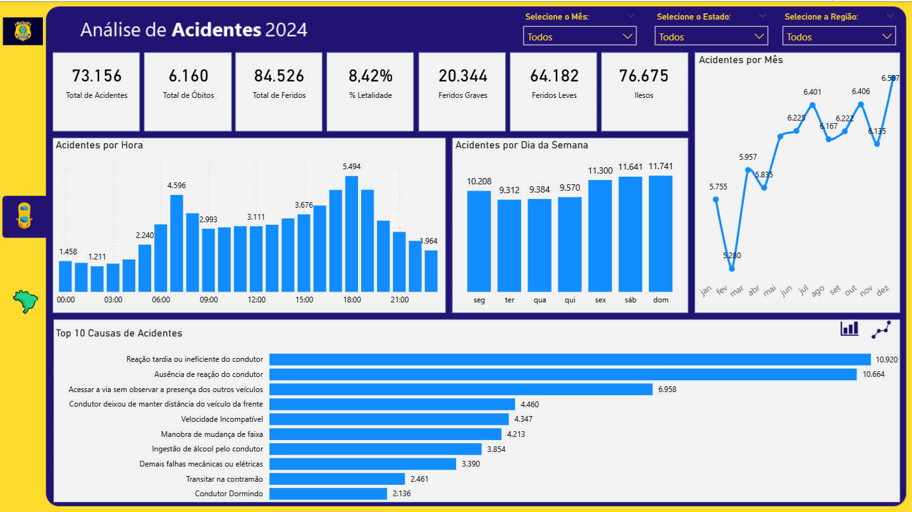
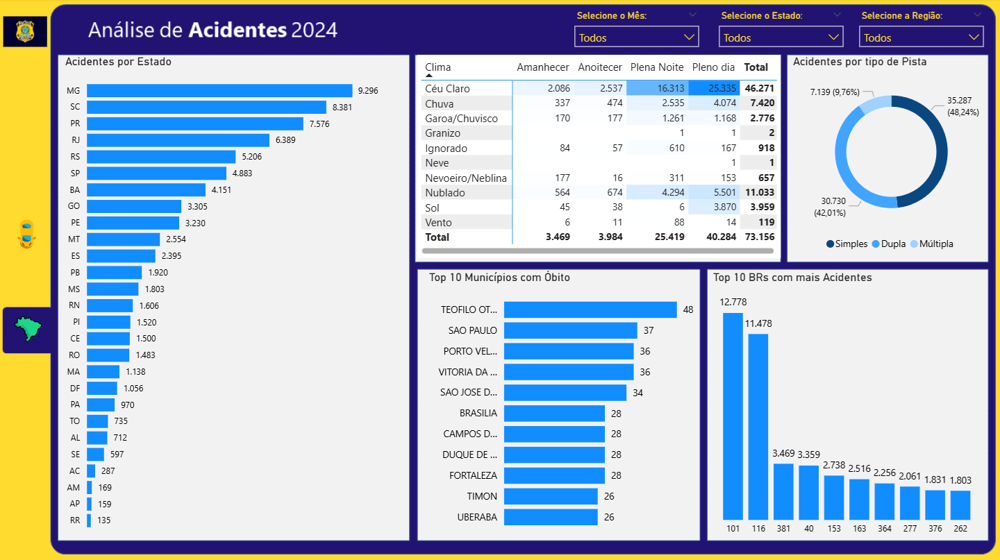

# Analise_de_Acidentes_de_Transito_2024_Power_BI

# 🚦 Dashboard de Análise de Acidentes em Rodovias Federais (PRF) (2024)

## 📊 Visão Geral do Projeto

Este projeto consiste em um dashboard analítico desenvolvido no **Power BI** para monitorar e diagnosticar a sinistralidade nas rodovias federais do Brasil. Utilizando dados abertos da **Polícia Rodoviária Federal (PRF)** referentes ao ano de 2024, o objetivo foi transformar dados brutos em inteligência para tomada de decisão focada em segurança viária.

O relatório foi estruturado para atender a uma demanda de negócio simulada, focando em responder perguntas-chave sobre **onde**, **quando** e **por que** os acidentes ocorrem.

---

## 🖼️ Visualização do Projeto

### Página 1: Panorama Geral (Executivo)
*Foco em volume total, localização geográfica e tendências temporais.*

### Página 2: Diagnóstico e Causas (Tático)
*Análise detalhada de causas raízes, correlação clima x horário e matriz de risco.*

---

## 💼 Problema de Negócio
A PRF necessitava de uma visão clara sobre os acidentes para otimizar a fiscalização. As principais perguntas de negócio respondidas foram:
1.  Qual o volume total de acidentes e vítimas (fatais e feridos)?
2.  Quais rodovias (BRs) concentram a maior parte dos acidentes (Princípio de Pareto)?
3.  Qual a relação entre fase do dia e condição meteorológica na gravidade dos acidentes?
4.  Quais os horários e dias da semana mais críticos?
5.  Quais as principais causas de acidentes fatais?

---

## 🛠️ Tecnologias e Técnicas Utilizadas

* **ETL (Power Query):** Limpeza de dados, tratamento de erros e criação de colunas condicionais (ex: categorização de horários em Madrugada/Manhã/Tarde/Noite).
* **Modelagem de Dados:** Criação de *Star Schema* (Esquema Estrela) com tabela fato e dimensões, incluindo uma tabela dCalendario dinâmica.
* **Visualização de Dados (Data Viz):**
    * Uso de **Tooltips (Dicas de Ferramenta)** personalizados para detalhamento ao passar o mouse.
    * Design de interface (UI) com background personalizado (criado no PowerPoint/Figma) para melhor experiência do usuário.
    * **Matriz de Risco** (Scatter Plot) cruzando volume vs. letalidade.

---
